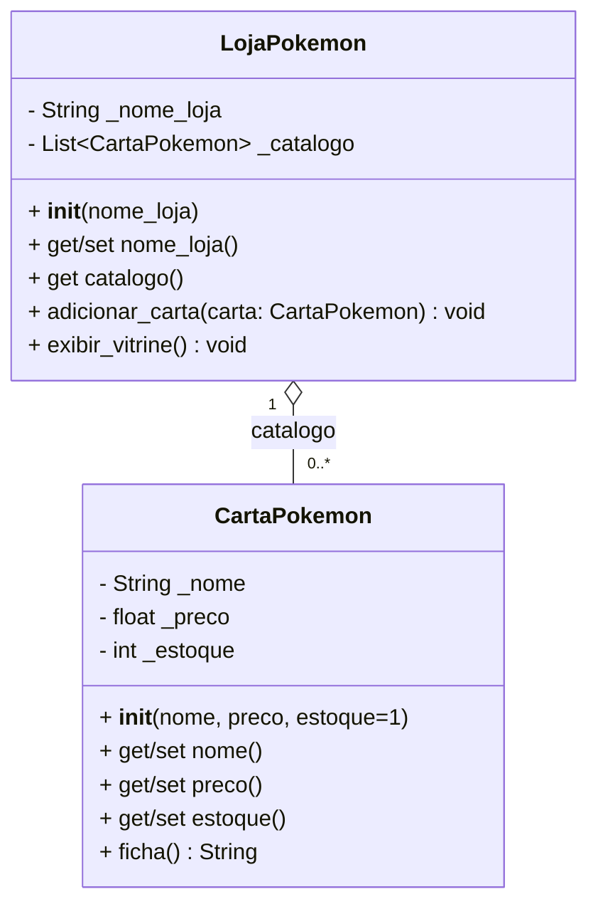

# Loja de Pokémon TCG - Modelagem OO

Este projeto implementa o modelo orientado a objetos para uma loja de cartas colecionáveis de Pokémon TCG.

## Diagrama de Classes (UML)

```mermaid
classDiagram
    class CartaPokemon {
        - String _nome
        - float _preco
        - int _estoque
        + __init__(nome, preco, estoque=1)
        + get/set nome()
        + get/set preco()
        + get/set estoque()
        + ficha() String
    }

    class LojaPokemon {
        - String _nome_loja
        - List~CartaPokemon~ _catalogo
        + __init__(nome_loja)
        + get/set nome_loja()
        + get catalogo()
        + adicionar_carta(carta: CartaPokemon) void
        + exibir_vitrine() void
    }

    LojaPokemon "1" o-- "0..*" CartaPokemon : catalogo
```
